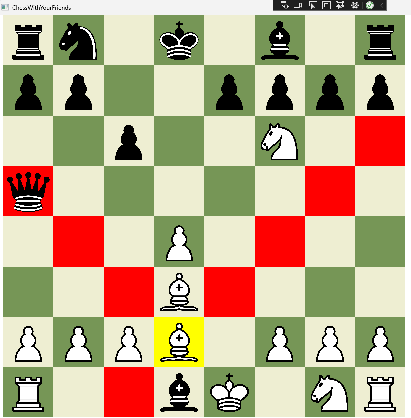
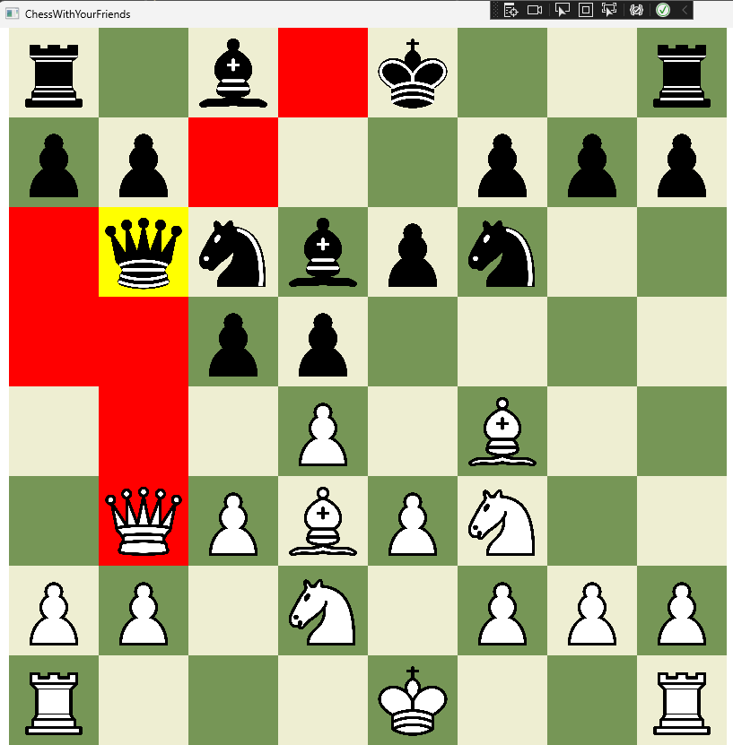

# ChessWithFriends
Chess written with C# using WPF-library for the Graphical User Interface.
Game is currently only for local play. There is currently no computer-opponents.
The gameplay loop is not yet 100% complete.

# Features:
- Simple chess implementation
- FEN-string input for custom board states is possible but is not currently implemented into the UI. 
For now GameWindow.xaml.cs row 74 from source code can be modified.

